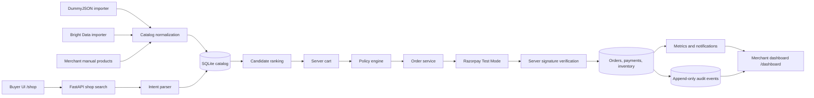

# Vastra Studio AI Commerce

Vastra Studio is a production-shaped AI commerce application for the Razorpay AI Buildathon. A shopper describes an intent in natural language, the system searches one local catalog assembled from DummyJSON, optional Bright Data imports, seeded products, and manual merchant products, proposes contextual budget-aware add-ons, creates a server-authoritative cart, and starts Razorpay Test Mode Checkout.

## Product routes

| Route | Experience | Purpose |
| --- | --- | --- |
| `/` | Landing | Product entry point and demo navigation |
| `/shop` | Buyer | Natural-language shopping, recommendation, upsell, cart, checkout |
| `/dashboard` | Merchant | Metrics, audit log, notifications, agent controls, policy controls |

Authentication is intentionally simplified for this hackathon demonstration. Production deployment would add merchant authentication and role-based access control.

## Architecture



### Responsibility boundaries

- **Frontend:** user experience, route state, loading states, and Razorpay Checkout launch.
- **FastAPI:** structured API responses, request validation, orchestration, and error translation.
- **Catalog service:** deterministic database filtering and relevance ranking.
- **Catalog sources:** DummyJSON is the primary optional baseline importer; Bright Data is an optional backend-only source; manual products are merchant-owned rows. All are persisted locally before retrieval.
- **Agent/LLM layer:** intent parsing, candidate ranking, recommendation explanations, and fallback behavior only.
- **Cart/order services:** authoritative prices, totals, inventory checks, order state, and idempotency.
- **Policy engine:** maximum order value, maximum upsell value, budget, inventory, discount, and confirmation rules.
- **Razorpay:** payment execution in Test Mode.
- **Bright Data ingestion:** backend-only catalog import that normalizes external products into SQLite; shoppers never call Bright Data during search.
- **Audit and metrics:** explainability and merchant reporting derived from persisted events and verified orders.

The browser never supplies an authoritative amount. The LLM never creates products, chooses final prices, marks payments as successful, or changes inventory.

## Repository layout

```text
backend/
  main.py              FastAPI routes and structured error handling
  db.py                SQLAlchemy engine and session setup
  models.py            SQLite models and state constants
  seed.py              Deterministic demo database seeding/reset
  seed_products.py     Vastra Studio catalog and relations
  catalog.py           Search, inventory, and related-product services
  brightdata.py        Bright Data normalization and idempotent ingestion
  dummyjson.py         Paginated DummyJSON fashion/lifestyle importer
  agent.py             Discovery state graph and deterministic fallback
  llm.py               NVIDIA-compatible reasoning boundary
  cart_service.py      Server-side cart and total calculation
  policy.py            Deterministic commerce guardrails
  orders.py            Razorpay order, verification, inventory, and states
  razorpay_tools.py    Razorpay client and HMAC signature verification
  audit.py             Append-only audit event service
  metrics.py           Event/order-derived merchant analytics
  tests/               Offline backend tests with Razorpay mocked at the boundary

agent-growth-hub-main/
  src/routes/index.tsx       Landing page and merchant dashboard
  src/routes/shop.tsx        Buyer experience
  src/routes/dashboard.tsx   Dedicated merchant route
  src/lib/api.ts             Frontend API client
  src/routeTree.gen.ts       TanStack Router route registry
  src/styles.css             Theme tokens and visual system
```

## Requirements

- Python 3.10 or newer
- Node.js 18 or newer
- npm
- Razorpay Test Mode keys for real Checkout
- NVIDIA API key is optional; deterministic fallback works without it

## Backend setup

From the repository root in PowerShell:

```powershell
python -m venv .venv
.\.venv\Scripts\Activate.ps1
python -m pip install --upgrade pip
python -m pip install -r backend\requirements.txt
Copy-Item backend\.env.example backend\.env
```

Edit `backend/.env` as needed:

```env
RAZORPAY_KEY_ID=rzp_test_...
RAZORPAY_KEY_SECRET=...
NVIDIA_API_KEY=...
NVIDIA_MODEL=meta/llama-3.1-70b-instruct
NVIDIA_BASE_URL=https://integrate.api.nvidia.com/v1
LLM_TIMEOUT_SECONDS=12
BRIGHTDATA_API_KEY=
BRIGHTDATA_API_URL=
# DATABASE_URL=sqlite:///backend/commerce.db
```

Never commit `backend/.env`. The Razorpay secret is server-only.

## Frontend setup

```powershell
Push-Location agent-growth-hub-main
npm install
Pop-Location
```

The frontend uses `VITE_API_BASE` when provided and otherwise defaults to `http://localhost:8000`.

## Run the project

Open two terminals from the repository root.

Terminal 1, backend:

```powershell
$env:PYTHONPATH = "."
python -m uvicorn backend.main:app --reload --host 127.0.0.1 --port 8000
```

Terminal 2, frontend:

```powershell
Push-Location agent-growth-hub-main
npm run dev
Pop-Location
```

Open the URL printed by Vite, normally `http://localhost:5173/`.

Useful direct URLs:

- `http://localhost:5173/`
- `http://localhost:5173/shop`
- `http://localhost:5173/dashboard`
- `http://127.0.0.1:8000/`
- `http://127.0.0.1:8000/docs`

## Demo flow

1. Open `/shop`.
2. Submit: `I need something for my sister's wedding under ₹4000`.
3. Confirm the recommended catalog product.
4. Add the related upsell only if it remains within budget.
5. Confirm the cart. The server recalculates the amount and creates a Razorpay order.
6. Complete Razorpay Test Mode Checkout.
7. The Checkout callback is sent to `/api/payments/verify`.
8. Open `/dashboard` and inspect verified revenue, notifications, inventory/order events, and the audit trail.

If Razorpay keys are not configured, discovery, catalog, cart, policy, and offline tests still work, but real Checkout cannot start.

## Bright Data catalog ingestion

Bright Data is an optional backend ingestion source. Configure `BRIGHTDATA_API_KEY` and `BRIGHTDATA_API_URL` in `backend/.env`, then trigger an import:

```powershell
Invoke-RestMethod -Method Post http://127.0.0.1:8000/api/catalog/import
```

The importer accepts a product list under `products`, `items`, `results`, or `data`. It normalizes names, prices, currency, stock, image/source URLs, brand, ratings, reviews, attributes, tags, and occasions. Imported rows are marked `source=brightdata` and deduplicated by external product id or name. Missing credentials or an unavailable service returns a useful error while the seeded SQLite catalog continues working.

## DummyJSON catalog ingestion

DummyJSON is the primary optional baseline source and does not run during shopper searches. It fetches the available catalog in pages, keeps fashion/lifestyle categories such as dresses, jewellery, bags, footwear, shirts, watches, sunglasses, beauty, fragrances, and tops, and stores normalized rows locally with `source=dummyjson` and a preserved external id.

```powershell
Invoke-RestMethod -Method Post "http://127.0.0.1:8000/api/catalog/import?source=dummyjson" -ContentType "application/json" -Body '{}'
```

The import is idempotent. A second run updates existing DummyJSON rows instead of duplicating them. If DummyJSON is unavailable, the existing local catalog remains usable.

## API reference

All API responses use this envelope:

```json
{"success": true, "data": "..."}
```

Errors use:

```json
{"success": false, "error": {"code": "...", "message": "...", "details": {}}}
```

### Discovery and catalog

```text
GET  /api/config
GET  /api/products?q=&category=&occasion=&limit=24
GET  /api/products/{product_id}
GET  /api/categories
POST /api/shop/search          {"query":"..."}
POST /api/catalog/import?source=dummyjson
POST /api/catalog/import?source=brightdata
POST /api/products             # validated manual merchant product
PATCH /api/products/{product_id}
DELETE /api/products/{product_id}  # archive/deactivate
```

### Cart

```text
POST   /api/cart               {"budget":4000,"ai_assisted":true}
GET    /api/cart/{cart_id}
POST   /api/cart/{cart_id}/items {"product_id":101,"quantity":1,"is_upsell":false}
PATCH  /api/cart/{cart_id}/items/{item_id} {"quantity":2}
DELETE /api/cart/{cart_id}/items/{item_id}
POST   /api/cart/{cart_id}/clear
```

The client sends product ids and quantities only. Cart prices and totals come from the database.
The buyer stores the demo customer id and active cart id locally so a refresh reconnects to the same server-side session.

### Orders and payments

```text
POST /api/orders/create
{"cart_id":1,"confirmed":true}

GET  /api/orders/{order_id}

POST /api/payments/verify
{"order_id":1,"razorpay_payment_id":"pay_...","razorpay_order_id":"order_...","razorpay_signature":"..."}

POST /api/payments/failed
{"order_id":1,"reason":"Buyer closed Checkout"}
```

The backend verifies the Razorpay HMAC signature and cross-checks the payment amount before setting the order to `COMPLETED` or decrementing inventory.

### Merchant operations

```text
GET  /api/metrics
GET  /api/chart-data
GET  /api/notifications
GET  /api/audit-log?source=AI&event_type=PRODUCT_RECOMMENDED&limit=50
POST /api/agent/toggle       {"active":true}
POST /api/config/policy      {"max_order_value":10000,"max_upsell_value":1500}
POST /api/demo/reset
```

`/api/demo/reset` is demo-only and resets transactional data/catalog state. Do not expose this endpoint in a production deployment.

## Tests and validation

Backend tests run offline and mock only the Razorpay boundary:

```powershell
$env:PYTHONPATH = "."
pytest -q backend/tests
```

Expected current result: 22 passing tests.

Frontend production build:

```powershell
Push-Location agent-growth-hub-main
npm run build
Pop-Location
```

Frontend lint and formatting:

```powershell
Push-Location agent-growth-hub-main
npm run lint
npm run format
Pop-Location
```

Use `npm run format` only when you intend to apply formatting changes.

## State and data model

SQLite persists:

- products and product relations
- customers
- carts and cart items
- orders and order items
- payments
- agent events/audit trail
- merchant configuration

Order states are explicit: `ORDER_CREATED`, `PAYMENT_FAILED`, `PAYMENT_VERIFICATION_FAILED`, `PAID`, `COMPLETED`, and `CANCELLED`. Inventory is decremented only once, after successful signature verification.

## Troubleshooting

### Frontend cannot reach the backend

Confirm the backend is running on port 8000 and set `VITE_API_BASE` before starting Vite:

```powershell
$env:VITE_API_BASE = "http://127.0.0.1:8000"
```

### Razorpay Checkout does not open

Confirm both `RAZORPAY_KEY_ID` and `RAZORPAY_KEY_SECRET` are set in `backend/.env`, restart Uvicorn, and use Test Mode keys. The frontend receives only the public key id.

### NVIDIA is unavailable

This is supported. The app falls back to deterministic intent parsing and catalog recommendation. No payment or catalog truth depends on the LLM.

### Reset demo data

```powershell
Invoke-RestMethod -Method Post http://127.0.0.1:8000/api/demo/reset
```

## Security notes

- No Razorpay secret or NVIDIA key is sent to the frontend.
- Client-provided amounts are ignored for order creation.
- Product ids and recommendation ids are validated against the database.
- Payment signatures are verified server-side.
- Payment verification is idempotent and inventory cannot be decremented twice.
- Raw backend exceptions are converted to structured generic errors.
- Shopping-domain guardrails redirect greetings, coding requests, and prompt-injection attempts instead of answering unrelated questions.
- DummyJSON and Bright Data credentials are never exposed to the frontend.
